<div align="center">
  

  # MindVault 🔐

  **Personal Knowledge Management System**

  *Store and categorize all your personal notes, tasks, reportee reviews, and reminders for easy access*

  [](https://mahadeer.github.io/mindvault/)
  [](https://www.rust-lang.org/)
  [](https://www.mongodb.com/)
  [](https://github.com/tokio-rs/axum)
  [](LICENSE)
</div>

---

## 🎯 Overview

MindVault is a robust, local, and intelligent knowledge management system built with **Rust**. It's designed to help you organize and gain insights from your personal notes, tasks, reportee reviews, to-dos, and reminders. MindVault is composed of several integrated components to provide a comprehensive solution for managing your personal data and leveraging the power of Large Language Models (LLMs).

### 🌟 Key Features

- 📝 **Personal Notes Management** - Store and organize your thoughts and ideas
- ✅ **Task Management** - Track to-dos with priorities and due dates
- 👥 **Reportee Reviews** - Manage performance reviews and feedback
- ⏰ **Reminders** - Never forget important dates and follow-ups
- 🔌 **Dual Integration** - Standalone UI + LLM integration via MCP server
- 🛡️ **Privacy First** - Local storage with optional cloud deployment

📚 **[View Full Documentation](https://mahadeer.github.io/mindvault/)** | 🧪 **[API Testing with Postman](https://mahadeer.github.io/mindvault/usage_examples.html)**

---

# Architecture Overview

The MindVault ecosystem consists of three main parts:

1.  **`mindvault-api`** (Axum-based Rust server):

    * Provides a REST + MCP-compatible API for all data operations, including comments, notes, and tasks.
    * Supports filtering data by keywords and time ranges.
    * Returns structured data optimized for LLM summarization and analysis.

2.  **`mindvault-ui`** (Dioxus-based web UI):

    * A web-based user interface for entering feedback, managing notes, and viewing summaries.
    * Interacts with `mindvault-api` via REST.

3.  **`mindvault-mcp`** (Rust MCP SDK project):

    * Utilizes the `rust-mcp` SDK to register tools with LLMs like LLM.
    * Internally calls `mindvault-api` to retrieve and format data.
    * Transforms the retrieved data into structured prompts suitable for LLMs.




-----

# Features

MindVault is designed as a comprehensive personal knowledge management system that serves as your central hub for organizing notes, tasks, reviews, and reminders.

## 📝 Personal Notes Management

### Core Features
- **Rich Text Support**: Store formatted notes with markdown support
- **Categorization**: Organize notes with tags and categories
- **Full-Text Search**: Find notes quickly using content search
- **Version History**: Track changes and maintain note history
- **Attachments**: Link files and documents to notes (planned)

### Organization
- **Tag System**: Flexible tagging for easy categorization
- **Folder Structure**: Hierarchical organization of notes
- **Favorites**: Mark important notes for quick access
- **Archive**: Soft delete with archive functionality

## ✅ Task Management

### Task Features
- **CRUD Operations**: Create, read, update, and delete tasks
- **Priority Levels**: High, Normal, Low priority assignment
- **Status Tracking**: Pending, In Progress, Completed states
- **Due Dates**: Set and track deadlines
- **Bulk Operations**: Efficient bulk create and update operations

### Advanced Capabilities
- **Search & Filter**: Find tasks by name, status, priority, or due date
- **Soft Delete**: Maintain data integrity with soft deletion
- **Partial Updates**: Update only specific fields
- **Auto-increment IDs**: Efficient ID generation for bulk operations

## 👥 Reportee Reviews Management

### Review Features
- **Performance Tracking**: Store and organize employee reviews
- **Historical Data**: Maintain review history over time
- **Structured Feedback**: Organized feedback categories
- **Progress Monitoring**: Track improvement and development
- **Review Templates**: Standardized review formats (planned)

### Management Tools
- **Reportee Profiles**: Individual employee information
- **Review Scheduling**: Plan and track review cycles
- **Goal Setting**: Set and monitor objectives
- **Feedback Analytics**: Insights from review data (planned)

## ⏰ Reminders & Notifications

### Reminder Features
- **Date-based Reminders**: Set reminders for specific dates
- **Recurring Reminders**: Repeat reminders on schedule
- **Priority Levels**: Important vs. standard reminders
- **Categories**: Organize reminders by type
- **Snooze Functionality**: Postpone reminders (planned)

### Notification System
- **Due Date Alerts**: Notifications for approaching deadlines
- **Overdue Warnings**: Alerts for missed items
- **Daily Summaries**: Overview of upcoming items
- **Custom Notifications**: Personalized alert preferences (planned)

## 🔌 Integration Options

### Standalone Application
- **Web Interface**: Dedicated UI for direct interaction
- **Responsive Design**: Works on desktop and mobile
- **Offline Capability**: Local data storage and sync (planned)
- **Export/Import**: Data portability and backup

### LLM Integration
- **MCP Server Support**: Compatible with Model Context Protocol
- **AI Assistant Integration**: Works with Claude, ChatGPT, and others
- **Natural Language Queries**: Ask questions about your data
- **Smart Insights**: AI-powered analysis and summaries

### API Access
- **RESTful APIs**: Standard HTTP endpoints for all features
- **Authentication**: Secure API access (planned)
- **Rate Limiting**: API usage management
- **Webhooks**: Event-driven integrations (planned)

## 🛡️ Data Security & Privacy

### Privacy Features
- **Local Storage**: Data remains on your system
- **No Cloud Dependency**: Fully self-hosted option
- **Data Encryption**: Secure data storage (planned)
- **Access Control**: User authentication and authorization (planned)

### Data Integrity
- **Input Validation**: Comprehensive data validation
- **Backup & Recovery**: Data backup mechanisms
- **Audit Trail**: Track data changes and access
- **Data Migration**: Easy data export and import

## 🚀 Performance & Reliability

### Technical Excellence
- **Rust Backend**: High-performance, memory-safe implementation
- **MongoDB**: Flexible, scalable data storage
- **Efficient Indexing**: Fast search and retrieval
- **Optimized Queries**: Minimal database load

### Scalability
- **Bulk Operations**: Handle large data sets efficiently
- **Pagination**: Manage large result sets
- **Caching**: Improved response times (planned)
- **Load Balancing**: Scale for multiple users (planned)

## 🔍 Search & Discovery

### Search Capabilities
- **Full-Text Search**: Search across all content types
- **Advanced Filters**: Complex search criteria
- **Saved Searches**: Store frequently used queries
- **Search History**: Track previous searches

### Discovery Features
- **Related Content**: Find connected information
- **Trending Topics**: Popular tags and categories
- **Recent Activity**: Latest updates and changes
- **Smart Suggestions**: AI-powered content recommendations (planned)


-----

# Getting Started

Welcome to **MindVault**, a comprehensive personal knowledge management system designed to store and categorize all your personal notes, tasks, reportee reviews, and reminders for easy access.

## 🎯 Project Vision

MindVault serves as your central hub for personal knowledge management, offering:

- **📝 Personal Notes**: Store and organize your thoughts, ideas, and observations
- **✅ Task Management**: Track your to-dos, projects, and deadlines
- **👥 Reportee Reviews**: Manage performance reviews and feedback for team members
- **⏰ Reminders**: Never forget important dates, meetings, or follow-ups
- **🔍 Easy Access**: Quick search and categorization for instant retrieval

## 🔌 Integration Options

MindVault is designed to work in multiple ways:

1. **🖥️ Standalone Web Application**: Use the dedicated UI for direct interaction
2. **🤖 LLM Integration**: Connect with any MCP (Model Context Protocol) server-supported applications
3. **🔗 API Access**: Integrate with your existing tools and workflows

## 🚀 Quick Setup

These instructions will guide you through setting up and running MindVault on your local machine.

### Installation

1.  **Clone the Repository:**

    ```bash
    git clone https://github.com/mahadeer/mind_vault_app.git
    cd mind_vault_app
    ```

2.  **Build the Project:**
    Navigate to the `mind_vault_app` directory and build the projects.

    ```bash
    cargo build --release --package mindvault-mcp
    ```

    This will create optimized executables for `mindvault-tool` in their respective `target/release/` directories.


-----

# How to Run MindVault

MindVault can be run as a monolithic application or integrated with external tools.

#### Running as a Monolithic Application

If you're running the `mindvault-api` directly, you would typically start it from its `target/release/` directory:

```bash
./target/release/mindvault-api
```

```bash
./target/release/mindvault-ui
```

You would then interact with it via its API endpoints or the `frontend` UI.

#### Integration with External Tools (MCP Servers)

MindVault is designed to be launched and managed by external tools or workflows configured to interact with "MCP servers." If your external tool expects a configuration to launch and interact with an MCP server, you can configure it to run MindVault's API as follows:

```json
{
  "mcpServers": {
    "mindvault-local": {
      "command": "path/to/target/release/mindvault_mcp"
    }
  }
}
```

-----

# Usage Examples (LLM Input Text)

These examples demonstrate how to interact with MindVault for comprehensive personal knowledge management, including notes, tasks, reviews, and reminders.

### Personal Notes Management Examples

#### Creating and Managing Notes
1. "Create a note about today's team meeting: 'Discussed Q1 goals, Sarah will lead the mobile project, deadline is March 15th.' Tag it as 'meeting' and 'Q1-planning'."
2. "Add a note for my learning journal: 'Completed Rust async programming tutorial, key insight: tokio runtime manages async tasks efficiently.' Tag as 'learning' and 'rust'."
3. "Store this idea: 'New feature idea for the app - dark mode toggle in settings. Users have been requesting this.' Tag as 'feature-idea' and 'ui-ux'."
4. "Create a note about the client feedback: 'Client loves the new dashboard design but wants faster loading times. Consider implementing lazy loading for charts.' Tag as 'client-feedback' and 'performance'."

#### Searching and Organizing Notes
5. "Show me all notes tagged with 'meeting' from this week."
6. "Find notes containing 'performance' or 'optimization'."
7. "Get all my learning journal entries from the past month."
8. "Show me notes about client feedback that mention 'dashboard'."

### Reportee Reviews Management Examples

#### Creating and Managing Reviews
9. "Create a performance review for John Smith: 'Excellent work on the authentication module. Shows strong technical skills and attention to detail. Areas for improvement: communication in team meetings.' Set review date as January 15th, 2024."
10. "Add feedback for Sarah Johnson: 'Great leadership on the mobile project. Successfully coordinated with design team and delivered on time. Goal for next quarter: mentor junior developers.' Tag as 'leadership' and 'Q1-review'."
11. "Record a 1:1 meeting note for Mike Chen: 'Discussed career goals, interested in moving to senior role. Needs to improve code review skills and system design knowledge. Action: assign system design course.' Tag as '1on1' and 'career-development'."

#### Review Analysis and Tracking
12. "Show me all reviews for John Smith from the past year."
13. "Find all reviews mentioning 'leadership' skills."
14. "Get a summary of performance trends for my team this quarter."
15. "Show me action items from all recent 1:1 meetings."

### Reminders Management Examples

#### Setting Reminders
16. "Set a reminder for March 1st: 'Prepare Q1 performance reviews for the team'."
17. "Create a recurring weekly reminder: 'Send team status update to stakeholders' every Friday."
18. "Add a reminder for tomorrow: 'Follow up with client about the dashboard feedback'."
19. "Set a reminder for next Monday: 'Review and approve John's pull request for the authentication feature'."

#### Managing Reminders
20. "Show me all reminders for this week."
21. "What reminders do I have coming up in the next 3 days?"
22. "Mark the client follow-up reminder as completed."
23. "Snooze the performance review reminder until next week."

### Task Management Examples

#### Creating Tasks
24. "Create a task: 'Review code changes for the authentication module' with high priority, due next Friday."
25. "Add a new task called 'Update API documentation' with normal priority and set it as pending."
26. "I need to create a task for 'Prepare demo for stakeholders' with high priority, due on February 15th, 2024."
27. "Create a task: 'Fix login bug reported by QA team' and mark it as in progress with high priority."

#### Bulk Task Creation
28. "Create multiple tasks for our sprint planning:
   - 'Set up development environment' (high priority, pending)
   - 'Write unit tests for user service' (normal priority, pending)
   - 'Code review for feature branch' (high priority, pending)
   - 'Update deployment scripts' (normal priority, pending)"

29. "I need to create several tasks for the new project:
   - 'Research competitor analysis' due January 30th
   - 'Design system architecture' with high priority
   - 'Create project timeline' with normal priority"

#### Viewing and Searching Tasks
7. "Show me all my tasks."
8. "What tasks do I have with high priority?"
9. "Find all tasks that are currently in progress."
10. "Show me tasks that contain 'review' in the name."
11. "What tasks are due this week?"
12. "Find all completed tasks from last month."
13. "Show me all pending tasks with high priority."

#### Updating Tasks
14. "Mark task 'Review code changes' as completed."
15. "Change the priority of task ID 123 to high."
16. "Update task 'Prepare demo' to in progress status."
17. "Set the due date for task 'Update documentation' to February 20th."
18. "Change task 'Fix login bug' status to completed and priority to normal."

#### Bulk Updates
19. "Mark all pending tasks with 'review' in the name as in progress."
20. "Change all high priority completed tasks to normal priority."
21. "Update all tasks containing 'bug' to high priority and in progress status."
22. "Set all pending tasks due this week to high priority."

#### Deleting Tasks
23. "Delete task ID 456."
24. "Remove the task 'Old feature request'."
25. "Delete all completed tasks from last quarter."
26. "Remove all tasks with 'cancelled' in the name."

#### Complex Task Management
27. "Show me a summary of all high priority tasks that are overdue."
28. "What's my task completion rate for this month?"
29. "Find all tasks related to the authentication project and mark them as high priority."
30. "Create a daily standup summary of all in progress tasks."
31. "What tasks should I focus on today based on priority and due dates?"

### Comment/Note Management Examples

#### Adding Comments
32. "Add a note for Alice: 'Met with Alice, she mentioned a new client project starting next week.' Tag it as 'meeting' and 'client'."
33. "Record feedback for Bob: 'Excellent work on the frontend optimization, reduced load time by 40%.' Tag as 'performance' and 'frontend'."

#### Viewing Comments
34. "Show me all notes about Bob."
35. "Find notes tagged 'bug' and 'frontend'."
36. "Search all notes for 'performance review'."

#### Comment Analysis
37. "Summarize Bob's feedback from last month."
38. "What's the general sentiment of feedback for Alice over the last quarter?"
39. "Give me a daily summary of all new notes."
40. "What tags are available for notes?"

#### Managing Comments
41. "Update note ID 1234: 'Added crucial details about client requirements.'"
42. "Remove the note with ID 5678."

### Integrated Workflow Examples

#### Project Management
43. "Create tasks for the Q1 planning meeting and add notes about the discussion points."
44. "Show me all tasks and related feedback for the mobile app project."
45. "Create a comprehensive project status report including tasks, completion rates, and team feedback."

#### Team Management
46. "What tasks is each team member working on and what's their recent feedback?"
47. "Create tasks based on the issues mentioned in this week's retrospective notes."
48. "Generate a team performance summary including task completion and feedback sentiment."

#### Sprint Planning
49. "Create sprint tasks based on the backlog and add planning notes for each."
50. "Show me completed tasks from last sprint and any related feedback or blockers."
51. "Generate a sprint retrospective report with task metrics and team feedback."

---

## Project Planning Assistant

### Example Prompts

52. "Help me plan tasks for the new mobile app project. We need to cover design, development, testing, and deployment phases."
53. "Create a task breakdown for our Q2 website redesign project."
54. "I need to plan tasks for migrating our database to the cloud."
55. "Help me create tasks for onboarding a new team member."
56. "Plan tasks for our upcoming product launch campaign."
57. "Create a comprehensive task list for setting up our CI/CD pipeline."
58. "I need to break down the API refactoring project into manageable tasks."
59. "Help me plan tasks for the security audit and compliance project."

### Project Planning Template

**User Input:** "Help me plan tasks for the new mobile app project. We need to cover design, development, testing, and deployment phases."

**Expected Task Creation:**
```json
{
  "tasks": [
    {
      "name": "Create mobile app wireframes and mockups",
      "priority": "High",
      "status": "Pending",
      "dueDate": "2024-02-10"
    },
    {
      "name": "Set up React Native development environment",
      "priority": "High",
      "status": "Pending",
      "dueDate": "2024-02-05"
    },
    {
      "name": "Implement user authentication screens",
      "priority": "High",
      "status": "Pending",
      "dueDate": "2024-02-15"
    },
    {
      "name": "Develop core app navigation",
      "priority": "Normal",
      "status": "Pending",
      "dueDate": "2024-02-20"
    },
    {
      "name": "Write unit tests for core components",
      "priority": "Normal",
      "status": "Pending",
      "dueDate": "2024-02-25"
    },
    {
      "name": "Perform end-to-end testing",
      "priority": "High",
      "status": "Pending",
      "dueDate": "2024-03-01"
    },
    {
      "name": "Set up CI/CD pipeline for mobile deployment",
      "priority": "Normal",
      "status": "Pending",
      "dueDate": "2024-03-05"
    },
    {
      "name": "Deploy to app stores (iOS/Android)",
      "priority": "High",
      "status": "Pending",
      "dueDate": "2024-03-10"
    }
  ]
}
```

**Expected Response:**
"I've created a comprehensive task plan for your mobile app project with 8 key tasks covering all phases:

**📱 Design Phase (Due: Feb 10)**
- Create mobile app wireframes and mockups (High priority)

**⚙️ Development Setup (Due: Feb 5)**
- Set up React Native development environment (High priority)

**💻 Core Development (Due: Feb 15-20)**
- Implement user authentication screens (High priority)
- Develop core app navigation (Normal priority)

**🧪 Testing Phase (Due: Feb 25 - Mar 1)**
- Write unit tests for core components (Normal priority)
- Perform end-to-end testing (High priority)

**🚀 Deployment Phase (Due: Mar 5-10)**
- Set up CI/CD pipeline for mobile deployment (Normal priority)
- Deploy to app stores (High priority)

The timeline spans about 6 weeks with logical dependencies. I recommend starting with the development environment setup and wireframes in parallel, then proceeding through development, testing, and deployment phases."

### Additional Project Planning Examples

#### Website Redesign Project
**User Input:** "Create a task breakdown for our Q2 website redesign project."

**Expected Tasks:**
- Conduct user research and analytics review
- Create new design system and style guide
- Design homepage and key landing pages
- Develop responsive frontend components
- Implement CMS integration
- Perform cross-browser testing
- SEO optimization and performance testing
- Launch and monitor website performance

#### Database Migration Project
**User Input:** "I need to plan tasks for migrating our database to the cloud."

**Expected Tasks:**
- Assess current database structure and dependencies
- Choose cloud provider and migration strategy
- Set up cloud database environment
- Create data backup and rollback procedures
- Perform test migration with sample data
- Update application connection strings
- Execute full production migration
- Monitor performance and optimize queries

#### Team Onboarding Project
**User Input:** "Help me create tasks for onboarding a new team member."

**Expected Tasks:**
- Prepare workstation and development environment
- Create access accounts and permissions
- Schedule introduction meetings with team
- Assign onboarding buddy/mentor
- Review codebase and architecture documentation
- Complete first small feature or bug fix
- Conduct 30-day check-in and feedback session
- Update onboarding process based on feedback

### Project Planning Best Practices

#### Task Breakdown Principles
- **Granular Tasks**: Break large tasks into 1-3 day chunks
- **Clear Dependencies**: Identify which tasks must be completed before others
- **Realistic Timelines**: Account for complexity and potential blockers
- **Priority Assignment**: Mark critical path items as high priority
- **Resource Allocation**: Consider team capacity and skills

#### Timeline Management
- **Buffer Time**: Add 20% buffer for unexpected issues
- **Milestone Markers**: Create checkpoint tasks for major deliverables
- **Parallel Work**: Identify tasks that can be done simultaneously
- **Risk Mitigation**: Plan alternative approaches for high-risk tasks

---

## Advanced LLM Integration Patterns

### Context-Aware Task Management

#### Pattern 1: Intelligent Task Prioritization
**User Input:** "I have a deadline tomorrow and three high priority tasks. Help me prioritize."

**LLM Process:**
1. Fetch all high priority tasks
2. Analyze due dates and dependencies
3. Provide prioritized recommendations
4. Offer to update task priorities automatically

#### Pattern 2: Proactive Task Suggestions
**User Input:** "I just completed the authentication module."

**LLM Process:**
1. Mark authentication task as completed
2. Search for related/dependent tasks
3. Suggest next logical tasks
4. Offer to create follow-up tasks

#### Pattern 3: Smart Bulk Operations
**User Input:** "Clean up my completed tasks from last month."

**LLM Process:**
1. Search for completed tasks from specified timeframe
2. Present summary for confirmation
3. Perform bulk delete operation
4. Provide cleanup summary

### Error Handling and Recovery

#### Graceful Error Responses
**Scenario:** Task creation fails due to validation error

**LLM Response:**
"I couldn't create the task because the name field is required. Let me help you fix this. What would you like to name this task?"

#### Smart Retry Logic
**Scenario:** Network timeout during bulk operation

**LLM Response:**
"The bulk operation timed out. I was able to create 3 out of 5 tasks successfully. Would you like me to retry creating the remaining 2 tasks?"

### Integration with External Systems

#### Calendar Integration
**User Input:** "Create tasks for all my meetings this week."

**LLM Process:**
1. Fetch calendar events
2. Convert meetings to preparation/follow-up tasks
3. Set appropriate due dates and priorities
4. Create tasks with meeting context

#### Email Integration
**User Input:** "Create tasks from my unread emails marked as important."

**LLM Process:**
1. Scan important unread emails
2. Extract actionable items
3. Create tasks with email context
4. Link tasks back to original emails

-----

# Tech Stack

* **Language:**  Rust
* **Backend:**  Axum
* **Database:**  MongoDB
* **Frontend:**  Dioxus (WASM/React)
* **LLM Integration:**  Claude or LM Studio via `mindvault_mcp`


-----

## Project Layout

Here's a simplified overview of the project's folder structure:

```
📁 .github/
📄 Cargo.toml
📄 GITHUB_PAGES_SETUP.md
📁 mindvault-api/
  ├── 📄 Cargo.toml
  ├── 📂 src/
  │   ├── 📄 main.rs
  │   ├── 📄 models.rs
  │   ├── 📄 response_macro.rs
  │   ├── 📁 router/
  │   ├── 📁 services/
📁 mindvault-core/
  ├── 📄 Cargo.toml
  ├── 📂 src/
  │   ├── 📄 db.rs
  │   ├── 📄 lib.rs
  │   ├── 📄 models.rs
  │   ├── 📄 mongo_config.rs
  │   ├── 📁 repository/
📁 mindvault-mcp/
  ├── 📄 Cargo.toml
  ├── 📂 src/
  │   ├── 📄 main.rs
📁 mindvault-shared/
  ├── 📄 Cargo.toml
  ├── 📂 src/
  │   ├── 📁 dtos/
  │   ├── 📄 lib.rs
  │   ├── 📄 logger.rs
  │   ├── 📁 models/
  │   ├── 📁 utils/
📁 mindvault-ui/
  ├── 📄 Cargo.toml
  ├── 📂 src/
  │   ├── 📄 main.rs
📄 README.md
```


-----

<div style="
    background-color: #fff8dc; /* Cornsilk - a soft yellow */
    border-left: 5px solid #ffc107; /* Amber yellow border */
    padding: 15px;
    margin: 15px 0;
    border-radius: 5px;
    box-shadow: 0 2px 4px rgba(0,0,0,0.1); /* Subtle shadow */
">
    <p style="margin: 0; font-weight: bold; color: #333;">
        💡 Note: <span style="font-weight: normal;">Doc generated using a custom doc_builder, refer to <code>docs\doc_builder</code></span>
    </p>
</div>


## 🤝 Contributing

MindVault is currently designed for personal use. However, if you have suggestions or want to contribute, feel free to open an issue or submit a pull request!

### Development

- **Documentation**: [https://mahadeer.github.io/mindvault/](https://mahadeer.github.io/mindvault/)
- **API Testing**: Use the included Postman collection for comprehensive testing
- **Architecture**: Follow the existing layered architecture (Router → Service → Repository)

---

## 📄 License

This project is licensed under the MIT License—see the `LICENSE` file for details.

---

<div align="center">

  **MindVault** - Your Personal Knowledge Management System

  🔗 **Links:** [Documentation](https://mahadeer.github.io/mindvault/) • [API Guide](https://mahadeer.github.io/mindvault/usage_examples.html) • [Architecture](https://mahadeer.github.io/mindvault/architecture_overview.html)

  🛠️ **Built with:** [Rust](https://www.rust-lang.org/) • [Axum](https://github.com/tokio-rs/axum) • [MongoDB](https://www.mongodb.com/)

  ⭐ **Star this repo if you find it useful!**

</div>
